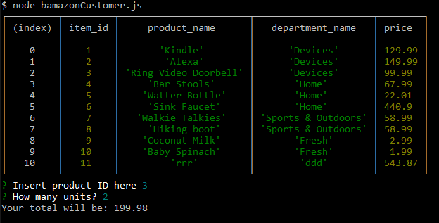
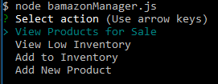
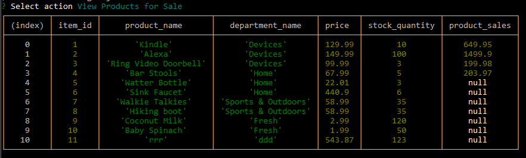
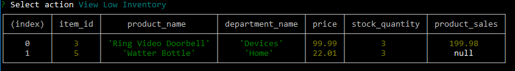
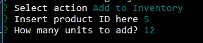
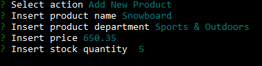
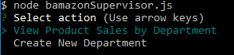
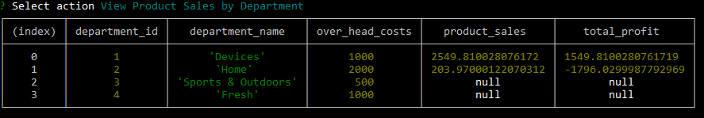
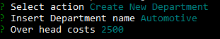

# BAMAZON - An Online Store
## Introduction
A set of applications to help managing and making purchases from an online store.
bamazon management system can be operated by three types of customers:
1. Consumer/Customer
2. Manager
3. Supervisor

## Prerequisites
* MySql database  - running on localhost port 3306
* Node.js - local installation

## Initial Setup
1. Place you MySql root password  to the following file: .env. File contents should look like:
```
PASSWORD=my_super_secure_password_12345
```
2. Run the following SQL script in MySql: bamazon_DB.sql
3. Open bash/terminal and run the following command:
```
npm install
```

## Store Consumer
Run the following command in bash/terminal:
```
node bamazonCustomer.js
```
You will see a list of availabile products and prompt to enter product ID and number of items you wish to purchase as shown below:



Once all the requested information is in - bamazon system will perform a purchase and show you the bill. System will warn you in case if requested number of items cannot be satisfied due to low stock.

## Store Manager
Run the following command in bash/terminal:
```
node bamazonManager.js
```
You will see 4 possible options to choose from as shown below:



### View Products for Sale
This option will display current state of things with products. availability and pricing as shown below:



### View Low Inventory
This option will display those products, which have less the 5 items in stock:



### Add To Inventory
This option allows store manager to add items to the inventory. Following prompts will be given:



### Add New Product
This option, after asking for some product details, will add a new product into inventory as show below:



## Store Supervisor
Run the following command in bash/terminal:
```
node bamazonSupervisor.js
```
You will see 2 possible options to choose from as shown below:



### View Product Sales by Department
This option will show total product sales and profit by department:



### Create New Department
This option created a new department in the online store. After prompting for name and overhead costs, the system will setup a new department:


